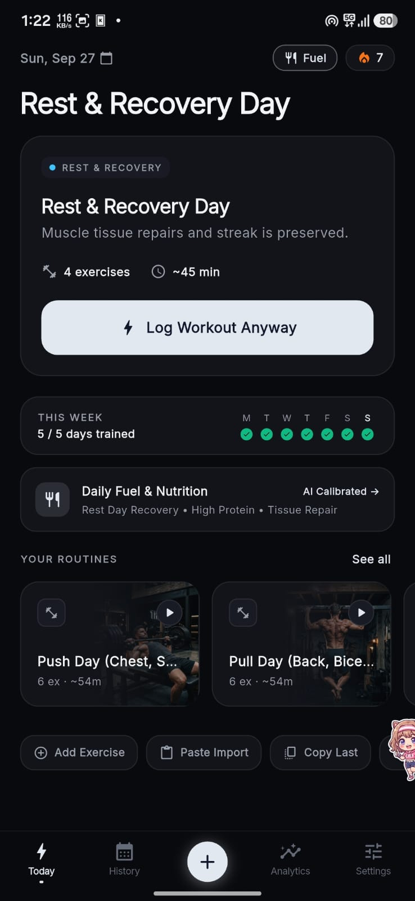
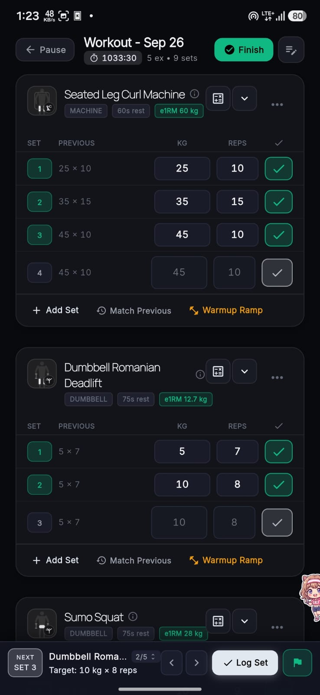
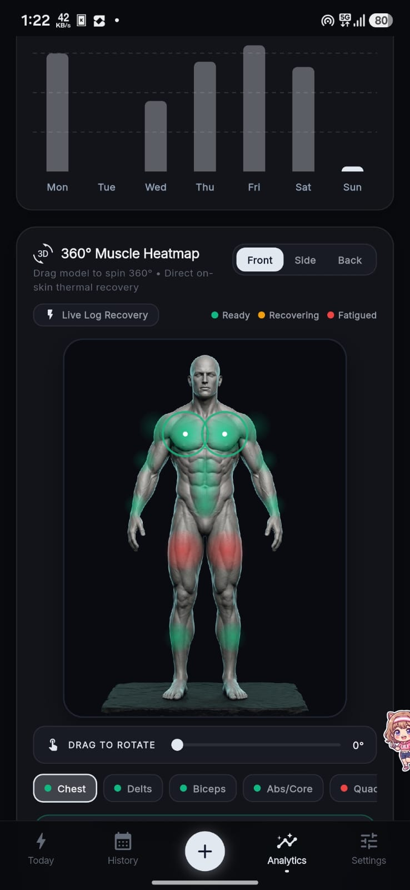
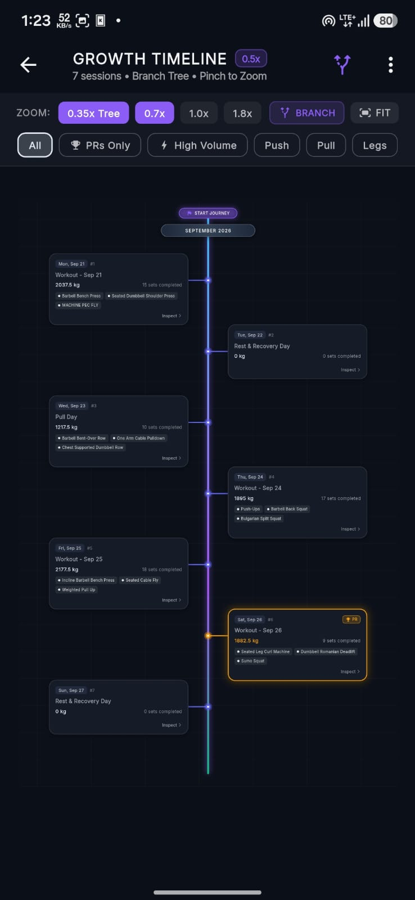
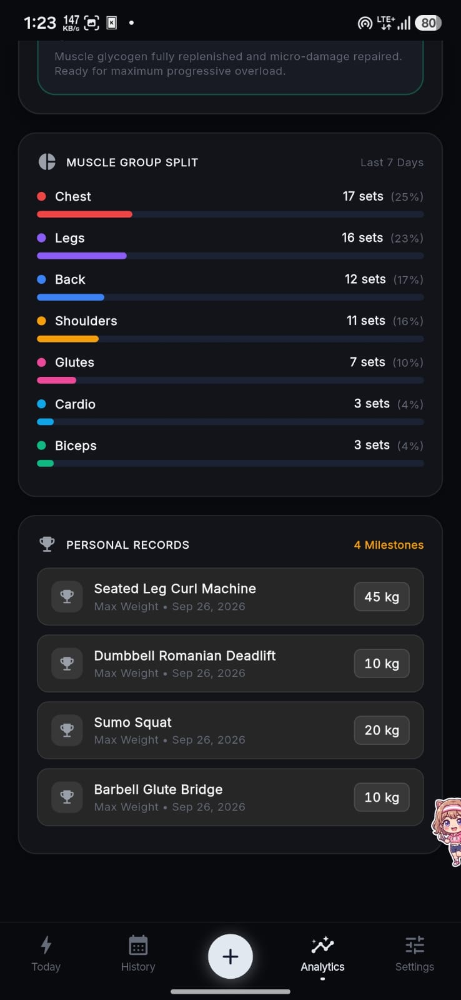
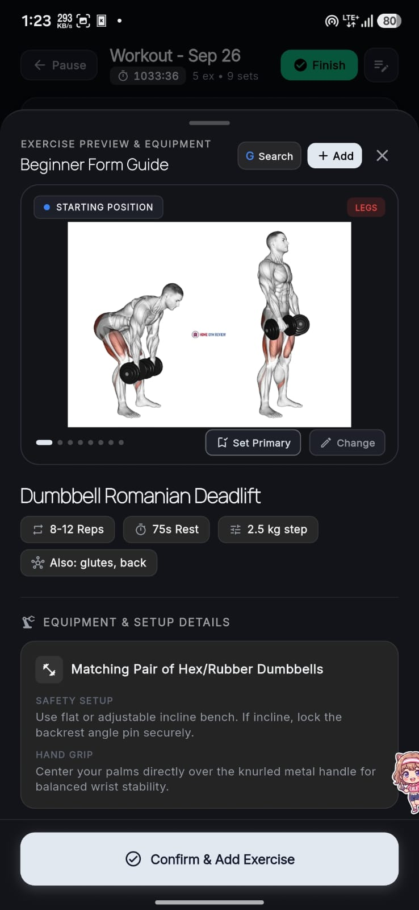
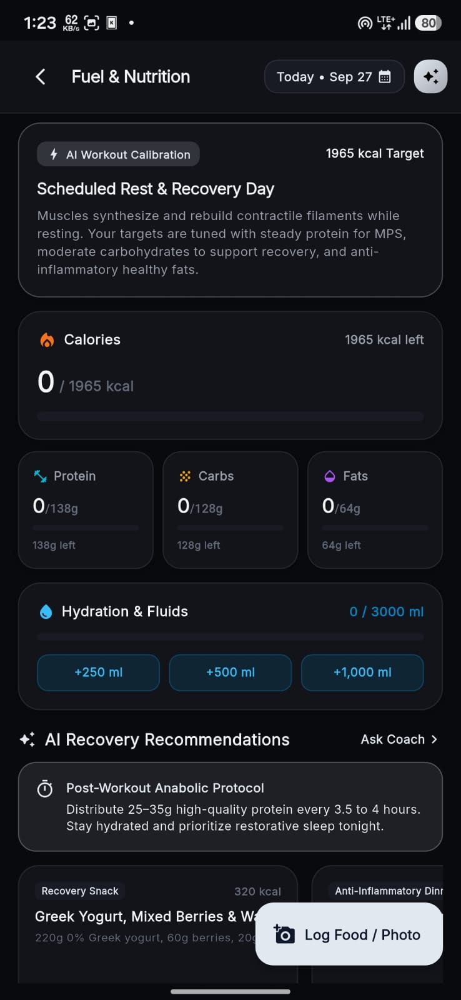
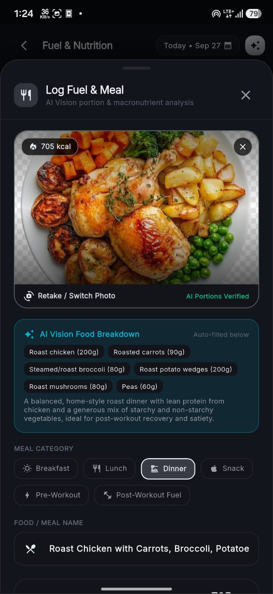
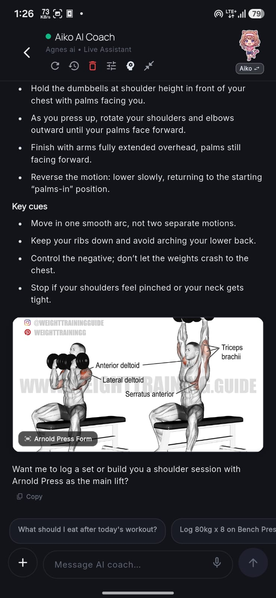

# IronLog

IronLog is an offline-first, performance-oriented strength training tracker and progression management platform built with Flutter. Designed for seamless single-handed operation during intense workouts, IronLog combines rigorous logging mechanics with local SQLite persistence, interactive 3D muscle recovery visualization, and intelligent computer vision nutrition analysis.

---

## Overview

IronLog operates entirely locally by default, prioritizing zero-latency logging, user data sovereignty, and reliable performance in environments with limited or no network connectivity. It includes structured progressive overload planning, automated 1RM estimation, an interactive growth timeline, and optional AI-assisted coaching and meal analysis.

---

## Key Capabilities

### Workout Tracking and Ergonomics
- Single-Hand Optimized HUD: Docked fast-entry numeric keypad, one-tap set confirmation, and swipe-to-complete interactions configured for in-session use.
- Live Session Management: Real-time workout duration monitoring, rest interval timing, and intelligent target calculation based on preceding session performance.
- Automated PR Detection: Continuous milestone tracking with estimated one-rep maximum (e1RM) calculations and volume progression analysis.
- Plate and Warmup Calculators: Dynamic plate loading visualizer and automated progressive warmup ramp generation.

### 3D Visualization and Analytics
- 360-Degree Muscle Recovery Heatmap: Interactive 3D anatomical turntable illustrating localized muscular fatigue and recovery readiness across multi-angle views.
- Branching Growth Timeline: Zoomable visual history tree mapping workout cadence, consistency streaks, and milestone achievements over time.
- Muscle Volume Distribution: Granular breakdown of training set allocations across major muscle groups and movement patterns.

### Nutrition and Recovery Architecture
- Automated Macro Tracking: Goal-oriented caloric and macronutrient targets calibrated directly against workout volume and rest schedules.
- Computer Vision Meal Logging: Photographic food analysis providing ingredient segmentation, portion estimation, and macronutrient logging.
- Hydration Logging: One-tap fluid intake tracking with daily hydration target monitoring.

### Knowledge Base and AI Assistance
- Comprehensive Movement Catalog: Detailed exercise library categorized by equipment type, target muscle group, and movement kinematics.
- Form Analysis and Setup Guides: Step-by-step exercise form guides with anatomical illustrations, execution cues, and safety guidelines.
- Intelligent Coaching Engine: Real-time contextual workout debriefs, technique guidance, and tailored training adjustments.

---

## Interface Preview

### Active Training and Analytics

| Today Dashboard | Active Session Logging | 360° Muscle Recovery Heatmap |
| :---: | :---: | :---: |
|  |  |  |

| Growth Timeline | Volume Analytics & PRs | Exercise Form Guides |
| :---: | :---: | :---: |
|  |  |  |

### Fuel, Nutrition & Intelligent Coaching

| Fuel & Nutrition Dashboard | AI Vision Meal Breakdown | Conversational Form Coach |
| :---: | :---: | :---: |
|  |  |  |

---

## Technical Architecture

```
lib/
├── core/                  # Theme tokens, base widgets, utilities, and design system
├── data/
│   ├── database/          # Drift SQLite schemas, queries, and type converters
│   └── repositories/      # Concrete data access layers and query optimizers
├── domain/
│   ├── models/            # Immutable domain entities, data classes, and enums
│   └── services/          # Pure business logic (e1RM, PR detection, image lookup)
├── features/
│   ├── analytics/         # 360° heatmap turntable, charts, volume breakdowns
│   ├── history/           # Workout logs, inspection sheets, growth timeline tree
│   ├── nutrition/         # Fuel tracker, AI vision analysis, hydration state
│   ├── settings/          # Data export/import, units, API integrations
│   └── today/             # Active logging HUD, docked numpad, routine templates
└── routes/                # GoRouter navigation shell and transitions
```

### Technology Stack
- Framework: Flutter 3.10+ (Dart 3.10+)
- State Management: Riverpod 2.x
- Database: Drift SQLite (reactive queries, migrations, transactional batching)
- Navigation: GoRouter with declarative shell routing
- Data Visualization: fl_chart and custom Canvas painters
- Design System: Custom Obsidian dark theme with glassmorphic depth layers

---

## Getting Started

### Prerequisites
- Flutter SDK (version 3.10.1 or higher)
- Android SDK (API level 21+) or iOS deployment target 13.0+
- Git

### Installation

1. Clone the repository:
   ```bash
   git clone https://github.com/makise-ui/ironlog.git
   cd ironlog
   ```

2. Install dependencies:
   ```bash
   flutter pub get
   ```

3. Generate Drift database bindings:
   ```bash
   dart run build_runner build --delete-conflicting-outputs
   ```

4. Run the application:
   ```bash
   flutter run
   ```

### Running Tests

Execute the automated test suite across domain, core, and presentation modules:

```bash
flutter test test/core/ test/domain/ test/presentation/
```

Static analysis check:

```bash
flutter analyze lib/
```

---

## Privacy and Data Security

IronLog follows an offline-first architecture:
- Local Storage: All workout logs, metrics, body statistics, and custom routines reside in an isolated SQLite database on your physical device.
- Network Independence: Core workout logging, analytics, rest timers, and calculations function completely without an internet connection.
- Optional AI Services: AI features (meal computer vision and coaching dialogs) require external API keys provided directly by the user. Requests are dispatched only when explicitly initiated by the user.

---

## License

This project is licensed under the terms of the MIT License. See the [LICENSE](LICENSE) file for full details.
